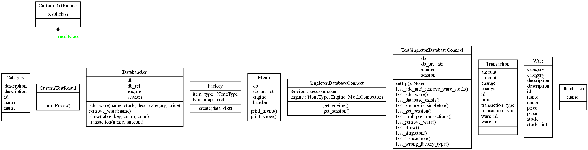
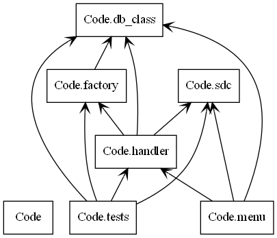

# Basic initial setup idea
## Table classes
* Wares:
  * ID
  * Name
  * Description
  * Category (relationship)
  * Price
  * Amount in stock
* Categories:
  * ID
  * Category name
  * Description
* Transactions:
  * ID
  * Ware ID
  * Time
  * Amount
  * Type of transaction
## Possible Functions
* Add Ware
* Remove Ware
* Update variable in Ware
* Show warehouse (both everything, and from a specific Category)
* Generate reports (Maybe gain and losses in every Ware category or simply for each month)
## Coding Style and Choices
* Forced to use OOP and mySQL
* Will use the Object Relation Mapper (ORM) from sqlalchemy to implement mySQL with nice [small examples](https://github.com/crazyguitar/pysheeet/blob/master/docs/notes/python-sqlalchemy.rst).

# Aftermath
After having a bit of a nuisance (3 days of troublesolving) getting MySQL to work (having needed to automatically find and run mysqlconfiguration), I have chosen to keep my implementation as simple as possible.
I understand that stored procedures is a good coding practice since allowing outsiders only access to use the stored procedures, means that they won't be able to launch any commands other than what is allowed making it a strong security measurement. As well as when having several calls almost identical, then we will be able to reuse the stored procedures reducing code density using IN and OUT for small variation possibilities. However with the frustation of wasting 3 days on getting the MySQL to work this was not implemented.

# Notes
When creating a new ware. ONLY for the current session Ware gets updated. To find the new category need to create a new session. With transaction again need to create a new session. Cannot see a reason why.

# Final Solution

* [Database Tables / Classes](Code/db_class.py)
   * `db_class` contains all of the tables in the database. It uses the Object Relational Mapper from SQLalchemy.

* [Handler for database calls](Code/handler.py)
    * `handler.py` handles all interaction with the database.

* [Singleton Database Connection using SQLAlchemy](Code/sdc.py)
    * `sdc.py` is a simple database connection that starts a SQLAlchemy `engine` and `session`

* [Tests](Code/tests.py)
    * `tests.py` tests all the handler functions to make sure functions and errors are handled correctly.

* [Menu](Code/menu.py)
    * `menu.py` is a simple terminal menu program.


## Installation

1. Create environment:
    ```
    python -m venv .venv
    ```

2. Activate environment:
    ```
    .venv\Scripts\activate
    ```

3. Install requirements:
    ```
    pip install -r requirements.txt
    ```

## Run

1. Run the tests:
make sure you're in directory with the tests: /code/
    ```
    python -m unittest newTest.py
    ```
    
2. Run the menu:
make sure you're in directory with the menu: /code/
    ```
    python menu.py
    ```
## Diagrams
The following diagrams are class and package diagrams autogenerated by pyreverse:
#### Classes

#### Packages

